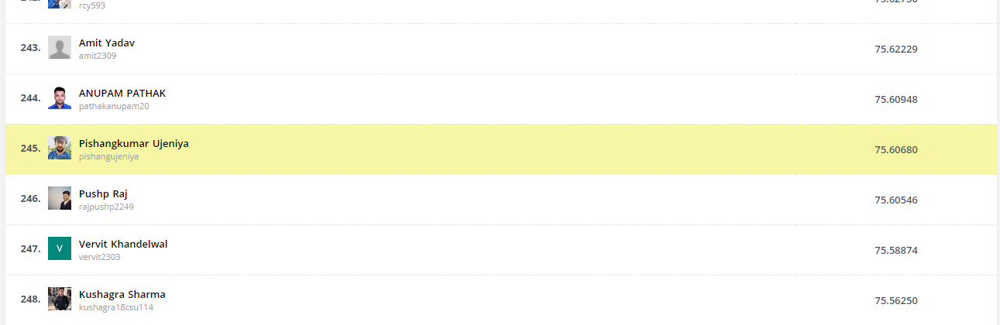

# [HackerEarth Machine Learning Challenge: How NOT to lose a customer in 10 days](https://www.hackerearth.com/challenges/competitive/hackerearth-machine-learning-challenge-predict-customer-churn/)
> Mar 16, 2021, 07:30 PM IST - Apr 15, 2021, 07:30 PM IST

## [245/4293 Ranked Leaderboard](https://www.hackerearth.com/challenges/competitive/hackerearth-machine-learning-challenge-predict-customer-churn/leaderboard/predict-the-churn-risk-rate-11-fb7a760d/page/5/)

### Problem

Churn rate is a marketing metric that describes the number of customers who leave a business over a specific time period.&nbsp;.&nbsp;Every user is assigned a prediction value that estimates their state of churn at any given time. This value is based on:

<ul>
	<li>User demographic information</li>
	<li>Browsing behavior</li>
	<li>Historical purchase data among other information</li>
</ul>

It factors in our unique and proprietary predictions of how long a user will remain a customer. This score is updated every day for all users who have a minimum of one conversion. The values assigned are between 1 and 5.

<h2><strong>Task</strong></h2>

Your task is to predict the churn score for a website based on the features provided in the dataset.

<h2><strong>Data description</strong></h2>

The dataset folder contains the following files:

<ul>
	<li><strong>train.csv</strong>: 36992 x 25</li>
	<li><strong>test.csv</strong>: 19919 x 24</li>
	<li><strong>sample_submission.csv</strong>: 5 x 2</li>
</ul>

The columns provided in the dataset are as follows:

<table border="1" style="width:500px">
	<tbody>
		<tr>
			<td style="text-align:center; width:157px"><strong>Column name</strong></td>
			<td style="text-align:center; width:327px"><strong>Description</strong></td>
		</tr>
		<tr>
			<td style="text-align:center; width:157px">customer_id</td>
			<td style="width:327px">Represents the unique identification number of a customer</td>
		</tr>
		<tr>
			<td style="text-align:center; width:157px">Name</td>
			<td style="width:327px">Represents the name of a customer</td>
		</tr>
		<tr>
			<td style="text-align:center; width:157px">age</td>
			<td style="width:327px">Represents the age of a customer</td>
		</tr>
		<tr>
			<td style="text-align:center; width:157px">security_no</td>
			<td style="width:327px">Represents a unique security number that is used to identify a person</td>
		</tr>
		<tr>
			<td style="text-align:center; width:157px">region_category</td>
			<td style="width:327px">Represents the region that a customer belongs to&nbsp;</td>
		</tr>
		<tr>
			<td style="text-align:center; width:157px">membership_category</td>
			<td style="width:327px">Represents the category of the membership that a customer is using</td>
		</tr>
		<tr>
			<td style="text-align:center; width:157px">joining_date</td>
			<td style="width:327px">Represents the date when a customer became a member&nbsp;</td>
		</tr>
		<tr>
			<td style="text-align:center; width:157px">joined_through_referral</td>
			<td style="width:327px">Represents whether a customer joined using any referral code or ID</td>
		</tr>
		<tr>
			<td style="text-align:center; width:157px">referral_id</td>
			<td style="width:327px">Represents a referral ID</td>
		</tr>
		<tr>
			<td style="text-align:center; width:157px">preferred_offer_types</td>
			<td style="width:327px">Represents the type of offer that a customer prefers</td>
		</tr>
		<tr>
			<td style="text-align:center; width:157px">medium_of_operation</td>
			<td style="width:327px">Represents the medium of operation that a customer uses for transactions</td>
		</tr>
		<tr>
			<td style="text-align:center; width:157px">internet_option</td>
			<td style="width:327px">Represents the type of internet service a customer uses</td>
		</tr>
		<tr>
			<td style="text-align:center; width:157px">last_visit_time</td>
			<td style="width:327px">Represents the last time a customer visited the website</td>
		</tr>
		<tr>
			<td style="text-align:center; width:157px">days_since_last_login</td>
			<td style="width:327px">Represents the no. of days since a customer last logged into the website</td>
		</tr>
		<tr>
			<td style="text-align:center; width:157px">avg_time_spent</td>
			<td style="width:327px">Represents the average time spent by a customer on the website</td>
		</tr>
		<tr>
			<td style="text-align:center; width:157px">avg_transaction_value</td>
			<td style="width:327px">Represents the average transaction value of a customer</td>
		</tr>
		<tr>
			<td style="text-align:center; width:157px">avg_frequency_login_days</td>
			<td style="width:327px">Represents the no. of times a customer has logged in to the website</td>
		</tr>
		<tr>
			<td style="text-align:center; width:157px">points_in_wallet</td>
			<td style="width:327px">Represents the points awarded to a customer on each transaction&nbsp;</td>
		</tr>
		<tr>
			<td style="text-align:center; width:157px">used_special_discount</td>
			<td style="width:327px">Represents whether a customer uses special discounts offered</td>
		</tr>
		<tr>
			<td style="text-align:center; width:157px">offer_application_preference</td>
			<td style="width:327px">Represents whether a customer prefers offers&nbsp;</td>
		</tr>
		<tr>
			<td style="text-align:center; width:157px">past_complaint</td>
			<td style="width:327px">Represents whether a customer has raised any complaints&nbsp;</td>
		</tr>
		<tr>
			<td style="text-align:center; width:157px">complaint_status</td>
			<td style="width:327px">Represents whether the complaints raised by a customer was resolved&nbsp;</td>
		</tr>
		<tr>
			<td style="text-align:center; width:157px">feedback</td>
			<td style="width:327px">Represents the feedback provided by a customer</td>
		</tr>
		<tr>
			<td style="text-align:center; width:157px">churn_risk_score</td>
			<td style="width:327px">Represents the churn risk score that ranges from 1 to 5</td>
		</tr>
	</tbody>
</table>

<h2><strong>Evaluation metric</strong></h2>

<pre class="prettyprint"><code>score = 100 x metrics.f1_score(actual, predicted, average="macro")</code></pre>

<h2><strong>Result submission guidelines</strong></h2>

<ul>
	<li>The index is <strong>customer_id</strong> and the target is the&nbsp;<strong>churn_risk_score</strong> column.&nbsp;</li>
	<li>The submission file must be submitted in <strong>.csv</strong> format only.</li>
	<li>The size of this submission file must be&nbsp;19919 x&nbsp;2.</li>
</ul>

<strong>Note</strong>: Ensure that your submission file contains the following:

<ul>
	<li>Correct index values as per the test file</li>
	<li>Correct names of&nbsp;columns as provided in the <strong>sample_submission.csv</strong> file</li>
</ul>

