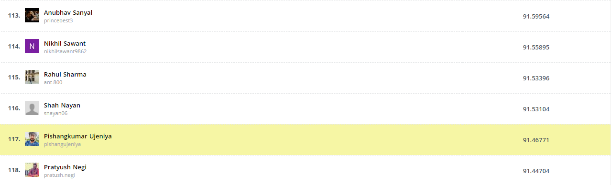

# HackerEarth Machine Learning Challenge: Exhibit A(rt)

[Leaderboard](https://www.hackerearth.com/challenges/competitive/hackerearth-machine-learning-challenge-predict-shipping-cost/leaderboard/predict-the-cost-to-ship-the-sculptures-12-e7728f5d/page/3/) - 117th rank

An art exhibitor is soon to launch an online portal for enthusiasts worldwide to start collecting art with only a click of a button. However, navigating the logistics of selling and distributing art does not seem to be a very straightforward task; such as acquiring art effectively and shipping these artifacts to their respective destinations post-purchase.

### Task

The exhibitor has hired you as a Machine Learning Engineer for this project. You are required to build an advanced model that predicts the cost of shipping paintings, antiques, sculptures, and other collectibles to customers based on the information provided in the dataset.

### Dataset Description

The dataset folder contains the following files:

<ul>
	<li><strong>train.csv</strong>:&nbsp;6500 x 20</li>
	<li><strong>test.csv</strong>: 3500 x 19</li>
	<li><strong>sample_submission.csv</strong>: 5 x 2</li>
</ul>

The columns provided in the dataset are as follows:

<table border="1" style="width:500px">
	<tbody>
		<tr>
			<td style="text-align:center; width:149px"><strong>Column name</strong></td>
			<td style="text-align:center; width:335px"><strong>Description</strong></td>
		</tr>
		<tr>
			<td style="text-align:center; width:149px">Customer Id</td>
			<td style="width:335px">Represents the unique identification number of the customers</td>
		</tr>
		<tr>
			<td style="text-align:center; width:149px">Artist Name</td>
			<td style="width:335px">Represents the name of the artist</td>
		</tr>
		<tr>
			<td style="text-align:center; width:149px">Artist Reputation</td>
			<td style="width:335px">
			
Represents the reputation of an artist in the market (the greater the reputation value, the higher the reputation of the artist in the market)

			</td>
		</tr>
		<tr>
			<td style="text-align:center; width:149px">Height</td>
			<td style="width:335px">Represents the height of the sculpture</td>
		</tr>
		<tr>
			<td style="text-align:center; width:149px">Width</td>
			<td style="width:335px">Represents the width of the sculpture</td>
		</tr>
		<tr>
			<td style="text-align:center; width:149px">Weight</td>
			<td style="width:335px">Represents the weight of the sculpture</td>
		</tr>
		<tr>
			<td style="text-align:center; width:149px">Material</td>
			<td style="width:335px">Represents the material that the sculpture is made of</td>
		</tr>
		<tr>
			<td style="text-align:center; width:149px">Price Of Sculpture</td>
			<td style="width:335px">Represents the price of the sculpture</td>
		</tr>
		<tr>
			<td style="text-align:center; width:149px">Base Shipping Price</td>
			<td style="width:335px">Represents the base price for shipping a sculpture</td>
		</tr>
		<tr>
			<td style="text-align:center; width:149px">International</td>
			<td style="width:335px">Represents whether the shipping is international</td>
		</tr>
		<tr>
			<td style="text-align:center; width:149px">Express Shipment</td>
			<td style="width:335px">Represents whether the shipping was in the express (fast) mode</td>
		</tr>
		<tr>
			<td style="text-align:center; width:149px">Installation Included</td>
			<td style="width:335px">Represents whether the order had installation included in the purchase of the sculpture</td>
		</tr>
		<tr>
			<td style="text-align:center; width:149px">Transport</td>
			<td style="width:335px">Represents the mode of transport of the order</td>
		</tr>
		<tr>
			<td style="text-align:center; width:149px">Fragile</td>
			<td style="width:335px">Represents whether the order is fragile</td>
		</tr>
		<tr>
			<td style="text-align:center; width:149px">Customer Information</td>
			<td style="width:335px">Represents details about a customer</td>
		</tr>
		<tr>
			<td style="text-align:center; width:149px">Remote Location</td>
			<td style="width:335px">Represents whether the customer resides in a remote location</td>
		</tr>
		<tr>
			<td style="text-align:center; width:149px">Scheduled Date</td>
			<td style="width:335px">Represents the date when the order was placed</td>
		</tr>
		<tr>
			<td style="text-align:center; width:149px">Delivery Date</td>
			<td style="width:335px">Represents the date of delivery of the order</td>
		</tr>
		<tr>
			<td style="text-align:center; width:149px">Customer Location</td>
			<td style="width:335px">Represents the location of the customer</td>
		</tr>
		<tr>
			<td style="text-align:center; width:149px">Cost</td>
			<td style="width:335px">Represents the cost of the order</td>
		</tr>
	</tbody>
</table>

<h2>Evaluation metric</h2>

<pre class="prettyprint"><code>score = 100*max(0, 1-metrics.mean_squared_log_error(actual, predicted))</code></pre>
