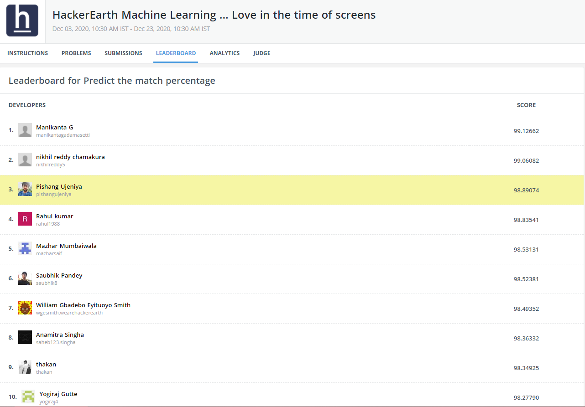

# [3rd/2541 Ranked Leaderboard](https://www.hackerearth.com/challenges/competitive/hackerearth-machine-learning-challenge-predict-match-percentage/leaderboard/predict-the-match-percentage-25-818cf487/page/1/)

## [Certificate](./Pishangkumar_Ujeniya_love_in_the_time_of_screens.pdf)

## [Code](./match_cosine_similarity_bio_location.ipynb)

# Predict Love Match

# [Competition Link - My Leaderboard](https://www.hackerearth.com/challenges/competitive/hackerearth-machine-learning-challenge-predict-match-percentage/leaderboard/predict-the-match-percentage-25-818cf487/)

## [HackerEarth Machine Learning Challenge: Love in the time of screens](https://www.hackerearth.com/challenges/competitive/hackerearth-machine-learning-challenge-predict-match-percentage/leaderboard/predict-the-match-percentage-25-818cf487/)
> Dec 03, 2020, 10:30 AM IST - Dec 23, 2020, 10:30 AM IST

### Problem statement

Just like that, with the blink of an eye, it’s the holiday season again. It’s indeed a wonderful time, no doubt, but is that the case for everyone? Unfortunately, it is not so. Thanksgiving, Christmas, and New Year’s Eve could, in fact, be a rather lonesome time for some of the singles out there. 

Don’t worry all ye single folks. We feel you. 

This is where technology comes into play. A modern invention such as online dating is really a godsend, especially in these times of not being able to go out and meet someone. But, how do you know if they are right for you from ‘behind the screens?’ Thanks to the latest advancement in technology, we can now accurately predict a match percentage between a couple of people. 

### The mission

A recently launched online dating site has assigned you the duty of playing Cupid and matching two lovebirds. As a Machine Learning expert, you are required to build a sophisticated model that predicts the match percentage between its users based on multiple attributes such as — their identifiers, preferences, interests, and the like.

Join #machine-learning channel on Slack

### Dataset

The dataset consists of parameters such as age, sex, orientation, their interests and preferences, and so on.

The benefits of practicing this problem by using Machine Learning techniques are as follows:

This challenge encourages you to apply your Machine Learning skills to build a model that predicts the match percentage between two individuals based on given parameter values.
This challenge will help you enhance your knowledge of Natural Language Processing (NLP). NLP is one of the advanced fields of Machine Learning and Artificial Intelligence.
We challenge you to build a model that successfully predicts the match percentage between two people.

### Prizes

Considering these unprecedented times that the world is facing due to the Coronavirus pandemic, we wish to do our bit and contribute the prize money for the welfare of society.

### Overview

Machine Learning is an application of Artificial Intelligence (AI) that provides systems with the ability to automatically learn and improve from experiences without being explicitly programmed. Machine Learning is a Science that determines patterns in data. These patterns provide a deeper meaning to problems. First, it helps you understand the problems better and then solve the same with elegance.

Here’s presenting HackerEarth’s Machine Learning challenge: Love in the time of screens

This challenge is designed to help you improve your Machine Learning skills by competing and learning from fellow participants.

### Why should you participate?

To analyze and implement multiple algorithms and determine which is more appropriate for a problem
To get hands-on experience in Machine Learning problems

### Who should participate?

Working professionals
Data Science or Machine Learning enthusiasts
College students (if you understand the basics of predictive modeling)
